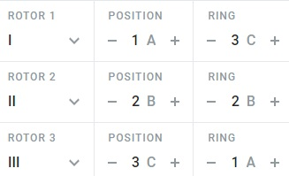

# CTF Cryptanalyse - Message seconde guerre mondiale

## Présentation du CTF 
**ID** 55 dans **les CTFs de Cyrhades**

## Trouvez le flag à partir du fichier 
[message.txt](message.txt)

## Indice

-----------

## Installation manuel
Vous n'utilisez pas l'application **les CTFs de Cyrhades** ? C'est dommage !
Mais voici comment installer ce CTF manuellement :

> git clone https://github.com/Hack-Oeil/WAR_MESSAGE.git

> cd WAR_MESSAGE
